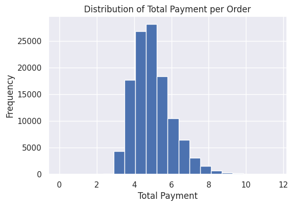
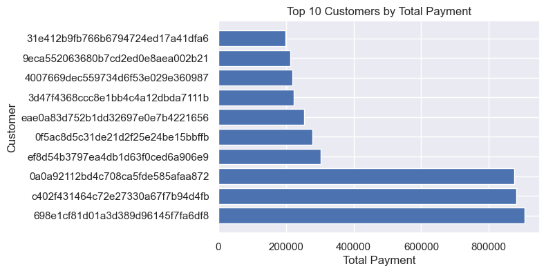
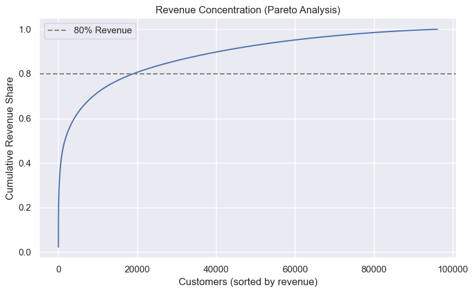

# EDA - Customer Behavior Analysis

## Project Overview

This project perform Exploratory Data Analysis (EDA) on an e-commerce dataset to understand customer purchasing behavior, revenue distribution, and order patterns.
The goal is to extract actionable business insights that can support data-driven decision making.

## Dataset

Brazilian E-Commerce Public Dataset by Olist

Source: https://www.kaggle.com/datasets/olistbr/brazilian-ecommerce

## Objectives
- Analyze customer purchasing frequency
- Identify revenue distribution and high-value outliers
- Understand customer contribution to total revenue
- Generate business recommendations based on findings

## Tools & Technologies

- Python
- Pandas
- NumPy
- Matplotlib / Seaborn
- Google Colab

## How to Run
1. Clone this repository:
```bash
git clone https://github.com/rismaamaliyah/eda-customer-behavior-analysis.git
```

2. Install required libraries:
```bash
pip install -r requirements.txt
```

3. Open the notebook:
```bash
jupyter notebook
```

## Key Analysis

- Data cleaning and preprocessing
- Order value distribution analysis
- Customer purchase frequency analysis
- Identification of top revenue-contributing customers
- Detection of skewness and outliers in transaction values

## Key Insights

### Order Value Distribution
This charts shows that order values are heavily right-skewed with significant high-value outliers.


### Top Customers by Revenue
A small group of customers contributes disproportionately to total revenue.


### Revenue Concentration (Pareto Analysis)
The top percentage of customers contributes the majority of total revenue.


## Business Recommendations

- Implement loyalty programs to retain high-value customers
- Design targeted campaigns to convert one-time buyers into repeat customers
- Reduce revenue concentration risk by nurturing mid-value customer segments
- Monitor high-value transactions for potential enterprise opportunities or fraud risk